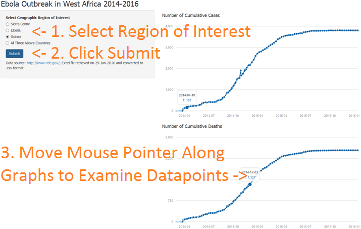

## The Ebola Outbreak

The current (as of January 2016) outbreak of the Ebola virus in West Africa is the biggest in history, resulting in significant loss of life.  

For more information, see:

* [World Health Organization](http://www.who.int/csr/disease/ebola/en/)
* [Centers for Disease Control and Prevention](http://www.cdc.gov/vhf/ebola/) 
* [Wikipedia](https://en.wikipedia.org/wiki/Ebola_virus_epidemic_in_West_Africa) 

--- .class #id 

## Data Source and Application Source Code

The data was downloaded from the CDC [website](http://www.cdc.gov/vhf/ebola/outbreaks/2014-west-africa/cumulative-cases-graphs.html), then subsequently converted to CSV format.

The source code for the application can be found here: [https://github.com/ernestyeung/DevelopingDataProducts.git](https://github.com/ernestyeung/DevelopingDataProducts.git)

--- .class #id 

## A Quick Look at the Data


```r
library(data.table)
ebola_data <- fread("graph1-cumulative-reported-cases-all.csv")
tail(ebola_data,n=1)
```

```
##    WHO report date Total Cases, Guinea Total Deaths, Guinea
## 1:      2016-01-13                3804                 2536
##    Total Cases, Liberia Total Deaths, Liberia Total Cases, Sierra Leone
## 1:                10675                  4809                     14122
##    Total Deaths, Sierra Leone
## 1:                       3955
```

--- .class #id 

## Location and Usage of the Application

The application can be found here: [https://eyeung.shinyapps.io/EbolaData/](https://eyeung.shinyapps.io/EbolaData/)

 

